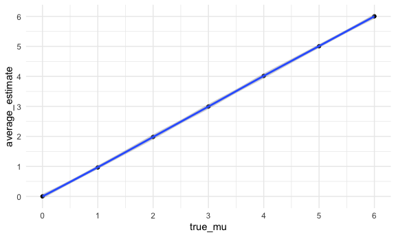

Homework 5
================
11/18/2020

# Problem 1

``` r
homocide_df = read_csv("homicide-data.csv") %>% 
  mutate(
    city_state = str_c(city,state,sep="_"),
    resolved = case_when(
      disposition == "Closed without arrest" ~ "unsolved",
      disposition == "Open/No arrest" ~ "unsolved",
      disposition == "Closed by arrest" ~ "solved",
    )
  ) %>% 
  select(city_state,resolved) %>% 
  filter(city_state != "Tulsa_AL")
```

    ## 
    ## ── Column specification ────────────────────────────────────────────────────────
    ## cols(
    ##   uid = col_character(),
    ##   reported_date = col_double(),
    ##   victim_last = col_character(),
    ##   victim_first = col_character(),
    ##   victim_race = col_character(),
    ##   victim_age = col_character(),
    ##   victim_sex = col_character(),
    ##   city = col_character(),
    ##   state = col_character(),
    ##   lat = col_double(),
    ##   lon = col_double(),
    ##   disposition = col_character()
    ## )

Look at the data

``` r
aggregate_df = homocide_df %>% 
  group_by(city_state) %>% 
  summarize(hom_total = n(),
            hom_unsolved = sum (resolved =="unsolved")
            )
```

    ## `summarise()` ungrouping output (override with `.groups` argument)

prop.test for Baltimore

``` r
prop.test(
  aggregate_df %>% filter(city_state =="Baltimore_MD") %>% pull(hom_unsolved),
  aggregate_df %>% filter(city_state =="Baltimore_MD") %>% pull(hom_total)
) %>% broom::tidy()
```

    ## # A tibble: 1 x 8
    ##   estimate statistic  p.value parameter conf.low conf.high method    alternative
    ##      <dbl>     <dbl>    <dbl>     <int>    <dbl>     <dbl> <chr>     <chr>      
    ## 1    0.646      239. 6.46e-54         1    0.628     0.663 1-sample… two.sided

prop.test for every state

``` r
result_df = aggregate_df %>% 
  mutate(
    prop_test=map2(.x = hom_unsolved, .y=hom_total, ~prop.test(x=.x, n=.y)),
    tidy_test = map(.x = prop_test, ~broom::tidy(.x))
  ) %>% 
  select(-prop_test) %>% 
  unnest(tidy_test) %>% 
  select(city_state, estimate, conf.low, conf.high)
```

``` r
result_df %>% 
  mutate(city_state=fct_reorder(city_state,estimate)) %>% 
  ggplot(aes(x=city_state,y=estimate))+
  geom_point()+
  geom_errorbar(aes(ymin=conf.low,ymax=conf.high))+
  theme(axis.text.x= element_text(angle=90, vjust = 0.5, hjust=1))
```

<!-- -->

\#Question 2

Create a dataframe containing all file names

``` r
path_df = 
  tibble(
    path = list.files(path = "lda_data")
  ) %>% 
  mutate(path = str_c("lda_data/",path)) %>% as.list()

ID_df =
  tibble(
    path = list.files(path = "lda_data")
  ) %>% 
  mutate(path = str_c("lda_data/",path))
```

Iterate over file name

``` r
import_data = function(x){
  
  ID_df %>% filter(path==x) %>% 
    mutate(
        read_csv(x)
    )
}

lda_df= map(path_df$path,import_data) %>% bind_rows()
```

    ## 
    ## ── Column specification ────────────────────────────────────────────────────────
    ## cols(
    ##   week_1 = col_double(),
    ##   week_2 = col_double(),
    ##   week_3 = col_double(),
    ##   week_4 = col_double(),
    ##   week_5 = col_double(),
    ##   week_6 = col_double(),
    ##   week_7 = col_double(),
    ##   week_8 = col_double()
    ## )
    ## 
    ## 
    ## ── Column specification ────────────────────────────────────────────────────────
    ## cols(
    ##   week_1 = col_double(),
    ##   week_2 = col_double(),
    ##   week_3 = col_double(),
    ##   week_4 = col_double(),
    ##   week_5 = col_double(),
    ##   week_6 = col_double(),
    ##   week_7 = col_double(),
    ##   week_8 = col_double()
    ## )
    ## 
    ## 
    ## ── Column specification ────────────────────────────────────────────────────────
    ## cols(
    ##   week_1 = col_double(),
    ##   week_2 = col_double(),
    ##   week_3 = col_double(),
    ##   week_4 = col_double(),
    ##   week_5 = col_double(),
    ##   week_6 = col_double(),
    ##   week_7 = col_double(),
    ##   week_8 = col_double()
    ## )
    ## 
    ## 
    ## ── Column specification ────────────────────────────────────────────────────────
    ## cols(
    ##   week_1 = col_double(),
    ##   week_2 = col_double(),
    ##   week_3 = col_double(),
    ##   week_4 = col_double(),
    ##   week_5 = col_double(),
    ##   week_6 = col_double(),
    ##   week_7 = col_double(),
    ##   week_8 = col_double()
    ## )
    ## 
    ## 
    ## ── Column specification ────────────────────────────────────────────────────────
    ## cols(
    ##   week_1 = col_double(),
    ##   week_2 = col_double(),
    ##   week_3 = col_double(),
    ##   week_4 = col_double(),
    ##   week_5 = col_double(),
    ##   week_6 = col_double(),
    ##   week_7 = col_double(),
    ##   week_8 = col_double()
    ## )
    ## 
    ## 
    ## ── Column specification ────────────────────────────────────────────────────────
    ## cols(
    ##   week_1 = col_double(),
    ##   week_2 = col_double(),
    ##   week_3 = col_double(),
    ##   week_4 = col_double(),
    ##   week_5 = col_double(),
    ##   week_6 = col_double(),
    ##   week_7 = col_double(),
    ##   week_8 = col_double()
    ## )
    ## 
    ## 
    ## ── Column specification ────────────────────────────────────────────────────────
    ## cols(
    ##   week_1 = col_double(),
    ##   week_2 = col_double(),
    ##   week_3 = col_double(),
    ##   week_4 = col_double(),
    ##   week_5 = col_double(),
    ##   week_6 = col_double(),
    ##   week_7 = col_double(),
    ##   week_8 = col_double()
    ## )
    ## 
    ## 
    ## ── Column specification ────────────────────────────────────────────────────────
    ## cols(
    ##   week_1 = col_double(),
    ##   week_2 = col_double(),
    ##   week_3 = col_double(),
    ##   week_4 = col_double(),
    ##   week_5 = col_double(),
    ##   week_6 = col_double(),
    ##   week_7 = col_double(),
    ##   week_8 = col_double()
    ## )
    ## 
    ## 
    ## ── Column specification ────────────────────────────────────────────────────────
    ## cols(
    ##   week_1 = col_double(),
    ##   week_2 = col_double(),
    ##   week_3 = col_double(),
    ##   week_4 = col_double(),
    ##   week_5 = col_double(),
    ##   week_6 = col_double(),
    ##   week_7 = col_double(),
    ##   week_8 = col_double()
    ## )
    ## 
    ## 
    ## ── Column specification ────────────────────────────────────────────────────────
    ## cols(
    ##   week_1 = col_double(),
    ##   week_2 = col_double(),
    ##   week_3 = col_double(),
    ##   week_4 = col_double(),
    ##   week_5 = col_double(),
    ##   week_6 = col_double(),
    ##   week_7 = col_double(),
    ##   week_8 = col_double()
    ## )
    ## 
    ## 
    ## ── Column specification ────────────────────────────────────────────────────────
    ## cols(
    ##   week_1 = col_double(),
    ##   week_2 = col_double(),
    ##   week_3 = col_double(),
    ##   week_4 = col_double(),
    ##   week_5 = col_double(),
    ##   week_6 = col_double(),
    ##   week_7 = col_double(),
    ##   week_8 = col_double()
    ## )
    ## 
    ## 
    ## ── Column specification ────────────────────────────────────────────────────────
    ## cols(
    ##   week_1 = col_double(),
    ##   week_2 = col_double(),
    ##   week_3 = col_double(),
    ##   week_4 = col_double(),
    ##   week_5 = col_double(),
    ##   week_6 = col_double(),
    ##   week_7 = col_double(),
    ##   week_8 = col_double()
    ## )
    ## 
    ## 
    ## ── Column specification ────────────────────────────────────────────────────────
    ## cols(
    ##   week_1 = col_double(),
    ##   week_2 = col_double(),
    ##   week_3 = col_double(),
    ##   week_4 = col_double(),
    ##   week_5 = col_double(),
    ##   week_6 = col_double(),
    ##   week_7 = col_double(),
    ##   week_8 = col_double()
    ## )
    ## 
    ## 
    ## ── Column specification ────────────────────────────────────────────────────────
    ## cols(
    ##   week_1 = col_double(),
    ##   week_2 = col_double(),
    ##   week_3 = col_double(),
    ##   week_4 = col_double(),
    ##   week_5 = col_double(),
    ##   week_6 = col_double(),
    ##   week_7 = col_double(),
    ##   week_8 = col_double()
    ## )
    ## 
    ## 
    ## ── Column specification ────────────────────────────────────────────────────────
    ## cols(
    ##   week_1 = col_double(),
    ##   week_2 = col_double(),
    ##   week_3 = col_double(),
    ##   week_4 = col_double(),
    ##   week_5 = col_double(),
    ##   week_6 = col_double(),
    ##   week_7 = col_double(),
    ##   week_8 = col_double()
    ## )
    ## 
    ## 
    ## ── Column specification ────────────────────────────────────────────────────────
    ## cols(
    ##   week_1 = col_double(),
    ##   week_2 = col_double(),
    ##   week_3 = col_double(),
    ##   week_4 = col_double(),
    ##   week_5 = col_double(),
    ##   week_6 = col_double(),
    ##   week_7 = col_double(),
    ##   week_8 = col_double()
    ## )
    ## 
    ## 
    ## ── Column specification ────────────────────────────────────────────────────────
    ## cols(
    ##   week_1 = col_double(),
    ##   week_2 = col_double(),
    ##   week_3 = col_double(),
    ##   week_4 = col_double(),
    ##   week_5 = col_double(),
    ##   week_6 = col_double(),
    ##   week_7 = col_double(),
    ##   week_8 = col_double()
    ## )
    ## 
    ## 
    ## ── Column specification ────────────────────────────────────────────────────────
    ## cols(
    ##   week_1 = col_double(),
    ##   week_2 = col_double(),
    ##   week_3 = col_double(),
    ##   week_4 = col_double(),
    ##   week_5 = col_double(),
    ##   week_6 = col_double(),
    ##   week_7 = col_double(),
    ##   week_8 = col_double()
    ## )
    ## 
    ## 
    ## ── Column specification ────────────────────────────────────────────────────────
    ## cols(
    ##   week_1 = col_double(),
    ##   week_2 = col_double(),
    ##   week_3 = col_double(),
    ##   week_4 = col_double(),
    ##   week_5 = col_double(),
    ##   week_6 = col_double(),
    ##   week_7 = col_double(),
    ##   week_8 = col_double()
    ## )
    ## 
    ## 
    ## ── Column specification ────────────────────────────────────────────────────────
    ## cols(
    ##   week_1 = col_double(),
    ##   week_2 = col_double(),
    ##   week_3 = col_double(),
    ##   week_4 = col_double(),
    ##   week_5 = col_double(),
    ##   week_6 = col_double(),
    ##   week_7 = col_double(),
    ##   week_8 = col_double()
    ## )

Data cleaning

``` r
clean_df = lda_df %>% 
  separate(path,into = c("prefix","ID"),sep="/",) %>% 
  select(-prefix) %>% 
  separate(ID,into = c("arm","ID"),sep="_") %>% 
  separate(ID,into = c("arm_ID","suffix"),convert = TRUE) %>% 
  select(-suffix) %>% 
  mutate(
    ID = str_c(1:20)
  ) %>% 
  select(ID,everything())
```

spaghetti plot

``` r
clean_df %>% 
  pivot_longer(
    week_1:week_8,
    names_to = "week",
    values_to = "value",
    names_prefix="week_"
  ) %>% 
    ggplot(aes(x=week,y=value,group=ID,color=arm))+
    geom_line()
```

<!-- -->

Generally, the observational value was higher among experimental group
than control group overtime. The observation value of subjects in
experimental were shown to be increasing over time, while those in
control group remained steady.

# Problem 3

Generate 5000 datasets & run t-test

``` r
sim_function = function(n=30,mu,sd=5){
  
  sim_data = tibble(
    x=rnorm(30, mean = mu, sd=5),
  )

  
  test_0 = t.test(sim_data$x,mu=0) %>% broom::tidy()
}

sim_result = rerun(5000,sim_function(mu=0)) %>% bind_rows()
```

repeat for different mu

``` r
rerun_function = function(x){
  rerun_result = rerun(5000,sim_function(mu=x)) %>% bind_rows() %>% mutate(
    true_mu = x
  )
}

vec_mu = tibble(mu = 0:6)
rerun_summary = map(.x=vec_mu$mu,~rerun_function(.x)) %>% bind_rows()
```

## plot 1: Association between effect size and power

``` r
rerun_summary = rerun_summary %>% 
  mutate(
    rejection=case_when(
      p.value<0.05 ~ 1,
      p.value>=0.05 ~ 0
    )
  ) 

reject_count = rerun_summary %>% 
  group_by(true_mu) %>% 
  summarize(reject = sum(rejection)) %>% 
  mutate(
    test_power = reject/5000
  )
```

    ## `summarise()` ungrouping output (override with `.groups` argument)

``` r
reject_count %>% 
  ggplot(aes(x = true_mu, y=test_power))+geom_point()+geom_smooth()+
  scale_x_continuous(breaks=c(0:6))
```

    ## `geom_smooth()` using method = 'loess' and formula 'y ~ x'

<!-- --> As effect
size becomes larger, the power of the t.tests also becomes higher until
reaches highest power possible (1)

## plot 2: average estimate of mu is and the true value of mu

``` r
rerun_summary %>% 
  group_by(true_mu) %>% 
  summarize(average_estimate = mean(estimate)) %>% 
  ggplot(aes(x = true_mu, y = average_estimate))+geom_point()+geom_smooth()+
  scale_x_continuous(breaks=c(0:6))+
  scale_y_continuous(breaks = c(0:6))
```

    ## `summarise()` ungrouping output (override with `.groups` argument)

    ## `geom_smooth()` using method = 'loess' and formula 'y ~ x'

<!-- -->

## plot 3 + plot 2: average estimate of mu only in samples for which the null was rejected on the y axis and the true value of μ on the x axis

``` r
plot_2 = rerun_summary %>% 
  group_by(true_mu) %>% 
  summarize(ave_estimate = mean(estimate))
```

    ## `summarise()` ungrouping output (override with `.groups` argument)

``` r
plot_3 = rerun_summary %>% 
  filter(rejection == 1) %>% 
  group_by(true_mu) %>% 
  summarize(ave_est_reject = mean(estimate))
```

    ## `summarise()` ungrouping output (override with `.groups` argument)

``` r
p3 = full_join(plot_2,plot_3) %>% pivot_longer(
  ave_estimate:ave_est_reject,
  names_to = "ave_type",
  values_to ="average_estimate"
) 
```

    ## Joining, by = "true_mu"

``` r
ggplot(p3, aes(x = true_mu, y= average_estimate, color = ave_type))+geom_point()+geom_smooth()+
  scale_x_continuous(breaks=c(0:6))+
  scale_y_continuous(breaks = c(0:6))
```

    ## `geom_smooth()` using method = 'loess' and formula 'y ~ x'

<!-- -->

The sample average of mu across tests for which the null is rejected is
approximately equal to the true mu at 0, but greater than true mu when
true mu is 1 or 2, and becomes similar again after 3.

When true µ = 0, most mu\_hat is around 0 despite that the null
hypothesis is rejected.

When true µ = 1, there are a large proportion of µ\_hat is similar to 0.
Only those deviate from 0 with a large extent the null hypothesis is
rejected. Therefore the average of µ\_hat is larger than true µ.

However, when effect size becomes larger, more mu\_hat is being
rejected. Therefore, the average of µ\_hat becomes similar to true µ
